# Lab-5-TwoActivities-LifeCycles

### TwoActivities Application Overview

- Application MainActivity Index
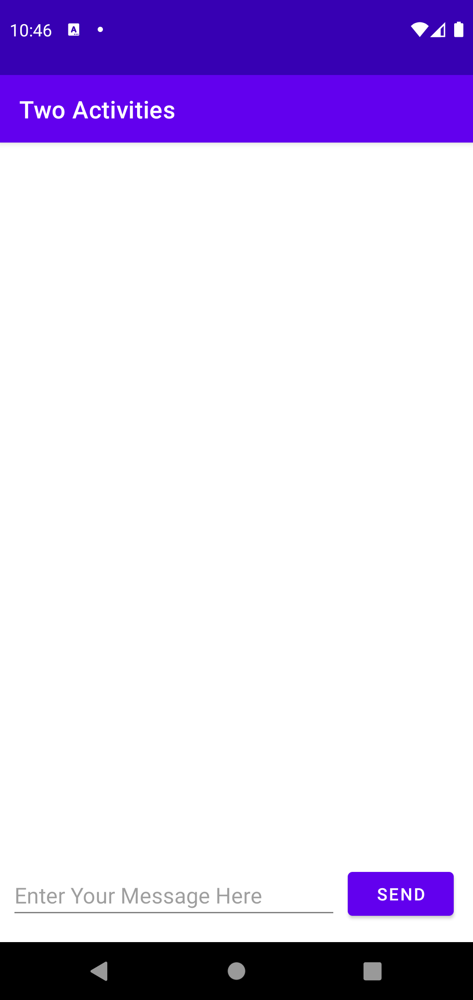

- Application SecondActivity Index
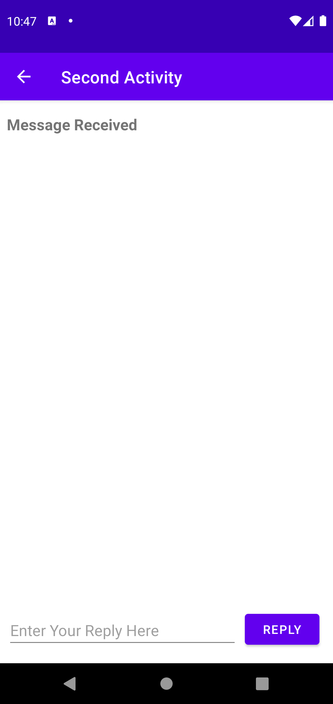

### TwoActivities Application Log Workings

- Create MainActivity
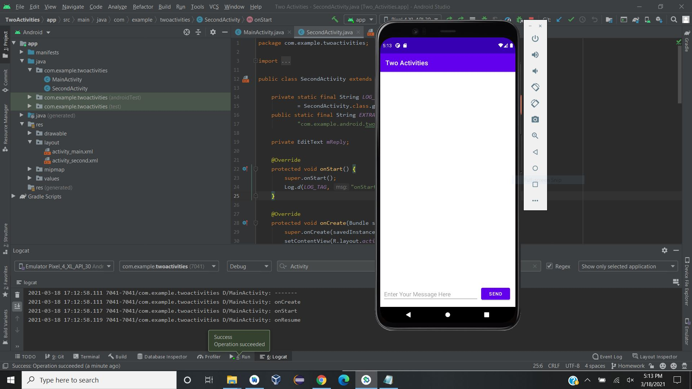

- Create SecondActivity

- Pause MainActivity

- Pause SecondActivity
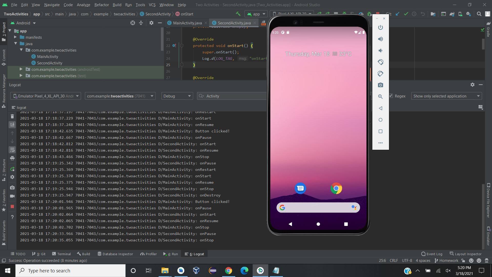

- Resume MainActivity
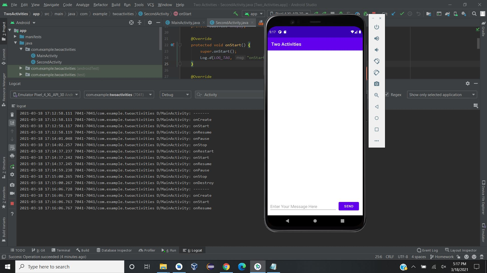

- Resume SecondActivity
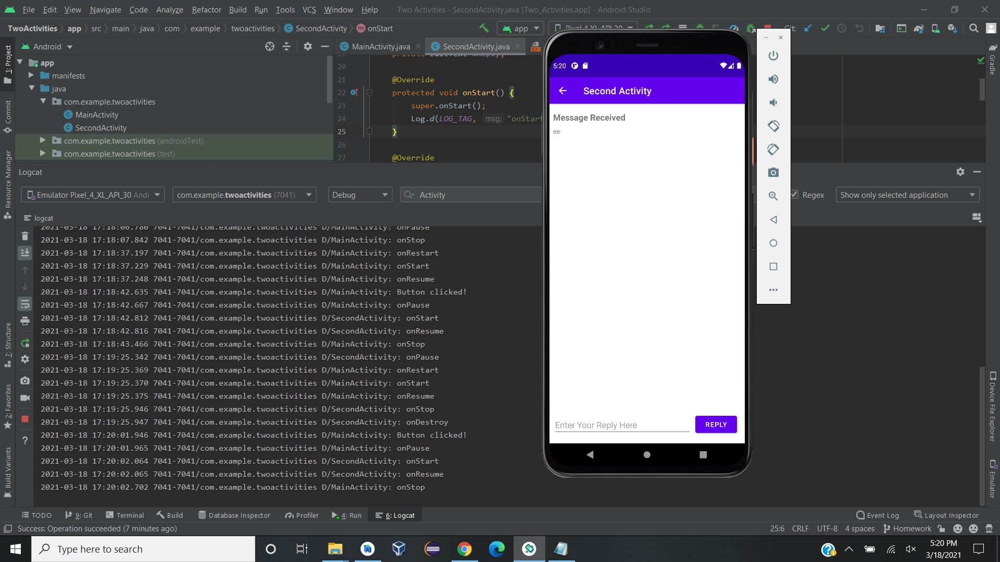

- Destroy MainActivity
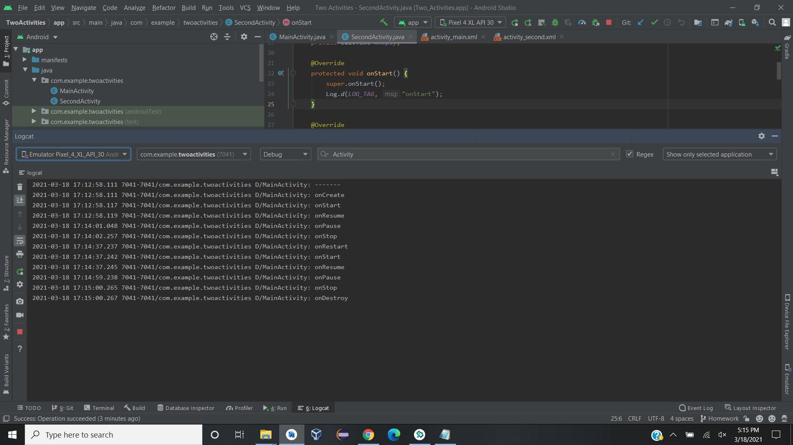

- Destroy SecondActivity

# Shopping-List Challenge

### Shopping-List Overview

- Application Shopping List Index 
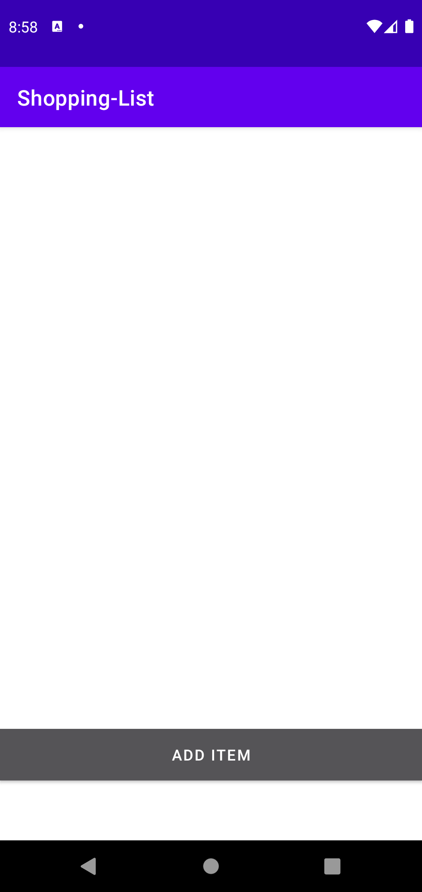

- Application Item List Index 
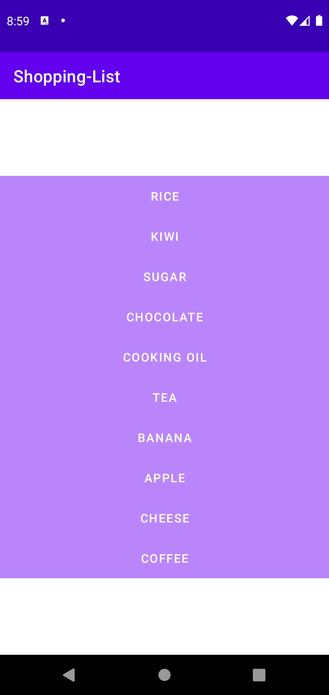

### Shopping-List Application Workings

- Add item Button 
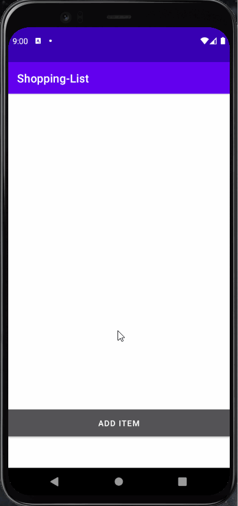

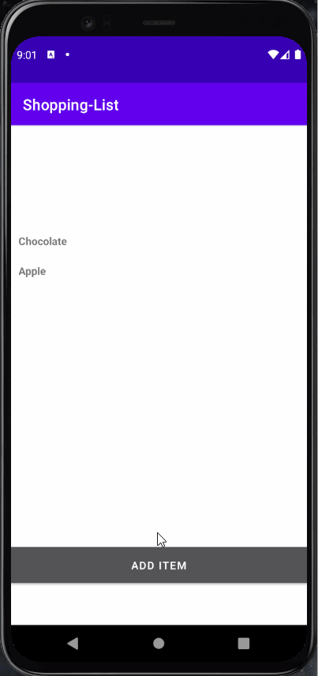

# Counter Homework

### Counter Homework Overview

- Application Index 
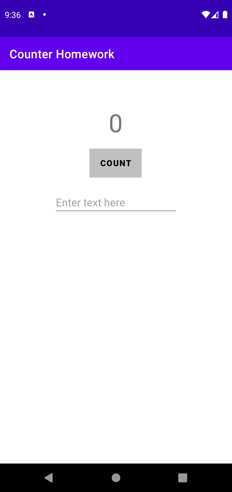

### Counter Homework Application Workings

- Saving Current State when Roatating phone
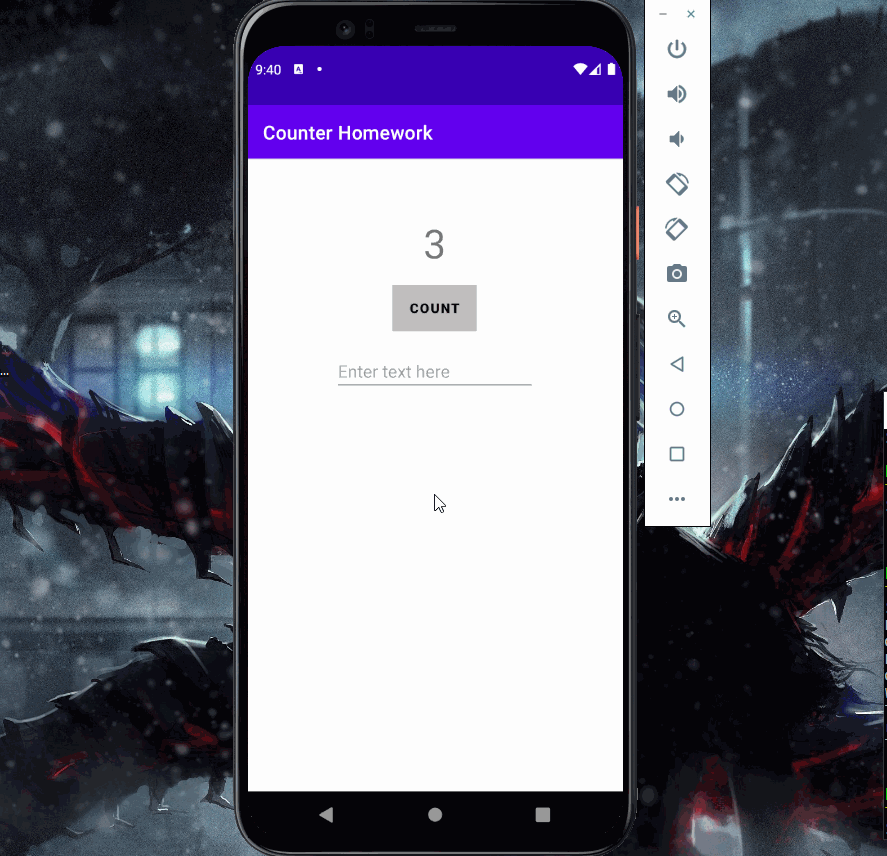

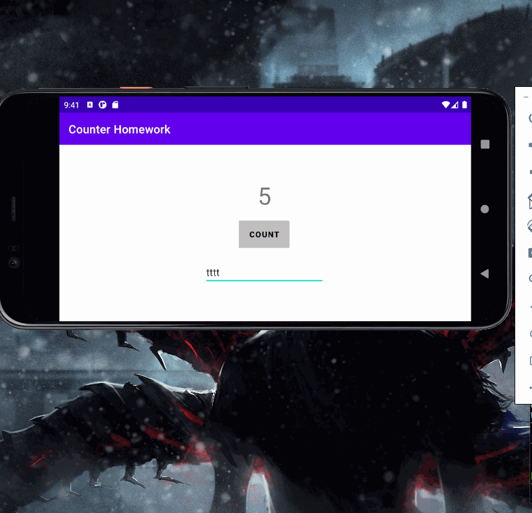

